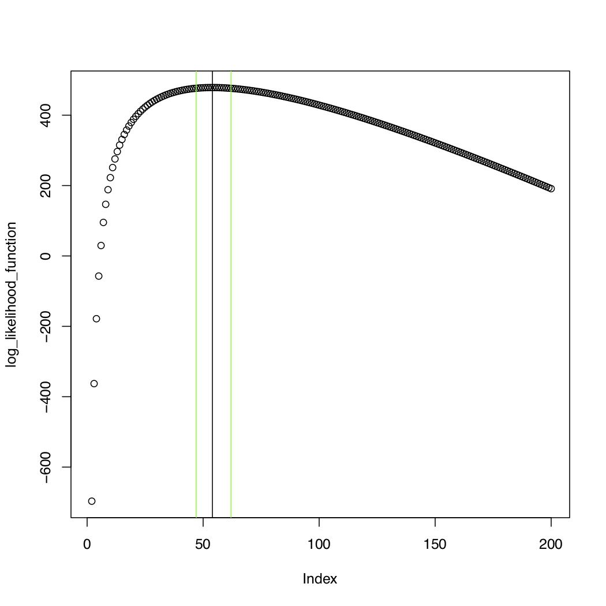
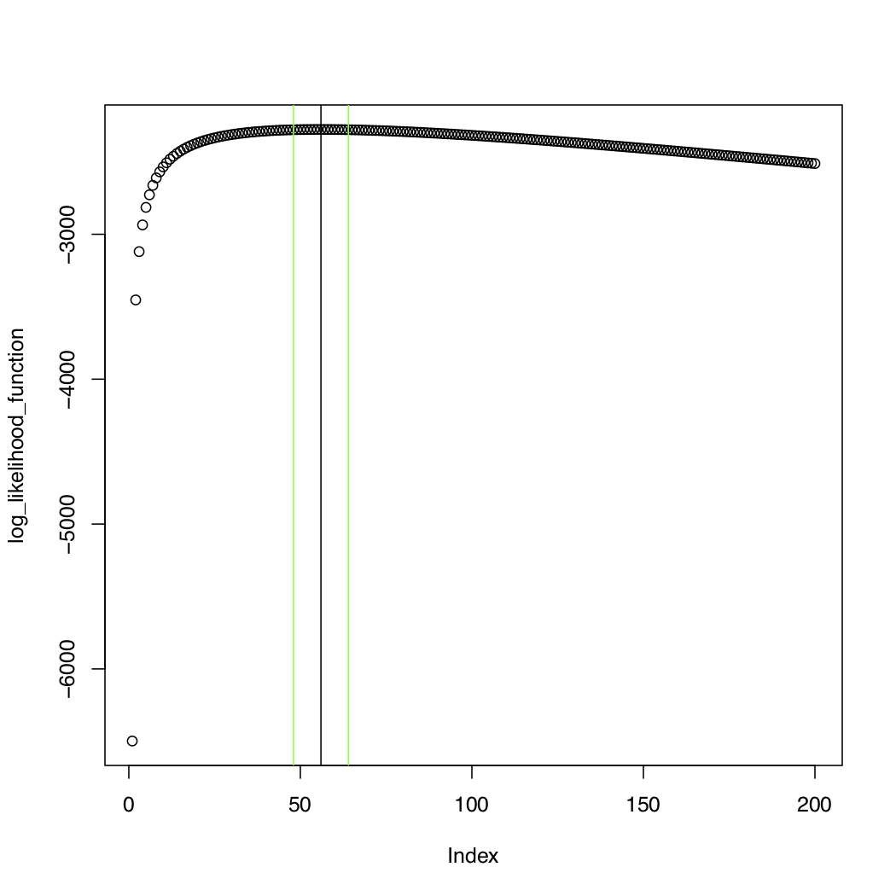

# BB Bottleneck Estimator
## Description
This is the implementation for [transmission bottleneck estimation based on beta-binomial sampling](https://www.biorxiv.org/content/10.1101/101790v1).  

## Requirements
- R 3.6+
- tidyverse
- argparse
- Rscript

Be sure to add the Rscript path to your environment variables or include the path when calling Rscript from the command line.  

## Examples

For the approximate code run

  Rscript  Bottleneck_size_estimation_approx.r --file "example_data/donor_and_recipient_freqs.txt"  --plot_bool TRUE  --var_calling_threshold 0.03  --Nb_min 1 --Nb_max 200 --confidence_level .95

The resulting output is

  [1] "Bottleneck size"  
  [1] 54  
  [1] "confidence interval left bound"  
  [1] 47  
  [1] "confidence interval right bound"  
  [1] 62  

For the exact code run

  Rscript  Bottleneck_size_estimation_exact.r --file "example_data/donor_freqs_recip_freqs_and_reads.txt"  --plot_bool TRUE  --var_calling_threshold 0.03  --Nb_min 1 --Nb_max 200 --confidence_level .95

The resulting output is

  [1] "Bottleneck size"  
  [1] 56  
  [1] "confidence interval left bound"  
  [1] 48  
  [1] "confidence interval right bound"  
  [1] 64  

The six command line arguments for the codes are:

- file: a file with lists of donor frequencies and recipient frequencies and reads (required)
- plot_bool:  logical that determines if pdf plot is produced (optional)
- var_calling_threshold: variant calling threshold (optional)
- Nb_min: minimum bottleneck size (optional)
- Nb_max: maximum bottleneck size (optional)
- confidence_level: confidence level (optional)

For the approximate code the first argument is a two column file, with the columns containing variant frequencies at each locus for the donor and recipient respectively.  For the exact code the first argument is a file with donor and recipient frequencies in the first two columns, total recipient reads in the third column, and variant recipient reads in the fourth column.  Files structured to run for the exact code can also be used with the approximate code.

If an optional argument is not given its default value will be assigned.
